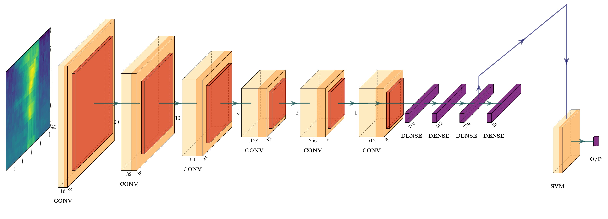

  [![Contributors][contributors-shield]][contributors-url] [![Forks][forks-shield]][forks-url] [![Stargazers][stars-shield]][stars-url] [![Issues][issues-shield]][issues-url] [![MIT License][license-shield]][license-url] [![LinkedIn][linkedin-shield]][linkedin-url]

<!-- PROJECT LOGO -->
<br />

<p align="center">
  <a href="https://github.com/vineeths96/Spoken-Keyword-Spotting">
    
  </a>
  <h3 align="center">Spoken Keyword Spotting</h3>
  <p align="center">
    Small footprint Spoken Keyword Spotting (KWS)
    <br />
    <a href=https://github.com/vineeths96/Spoken-Keyword-Spotting><strong>Explore the repository»</strong></a>
    <br />
    <a href=https://github.com/vineeths96/Spoken-Keyword-Spotting/blob/master/docs/report.pdf>View Report</a>
  </p>

</p>

> tags : spoken keyword spotting, kws, continuous speech kws , speech commands, cnn, svm, deep learning, sklearn, tensorflow


<!-- ABOUT THE PROJECT -->
## About The Project

Spoken Keyword Spotting is the task of identifying predefined words (called as keywords) from speech. Rapid developments and research in the areas of voice-based interaction with machines has tremendously influenced the heavy adaptation of these technologies into everyday life. With the development of devices such as Google Home, Amazon Alexa and Smartphones, speech is increasingly becoming a more natural way to interact with devices. However, always-on speech recognition is generally not preferred due to its energy inefficiency and network congestion that arises due to continuous audio stream from millions of devices to the cloud. Processing such a large amount of audio stream will require more time and adds to the latency and can have privacy issues.

Keyword Spotting (KWS) provides an efficient solution to all the above issues. Modern day voice-based devices first detect predefined keyword(s) — such as ”OK Google”, ”Alexa” — from the speech locally on the device. On successfully detecting such words, a full scale speech recognition is triggered on the cloud (or on the device). Since the KWS system is always-on, it is highly preferred to have low memory footprint and computation complexity, but with high accuracy and low latency. We explore using a hybrid system consisting of a Convolutional Neural Network and a Support Vector Machine for KWS task.

### Built With
This project was built with 

* python v3.8
* tensorflow v2.2
* The list of libraries used for developing this project is available at [requirements.txt](requirements.txt).


<!-- GETTING STARTED -->

## Getting Started

Clone the repository into a local machine and enter the [src](src) directory using

```shell
git clone https://github.com/vineeths96/Spoken-Keyword-Spotting
cd Spoken-Keyword-Spotting/src
```

### Prerequisites

Please install required libraries by running the following command (preferably within a virtual environment).

```shell
pip install -r requirements.txt
```

The Google Speech Commands dataset is downloaded and setup automatically (if not already present) and hence manual setup is not necessary. 

### Instructions to run

The `main.py` is the interface to the program. It is programmed to run in two modes – train mode and test mode. The `main.py` checks for saved models in the [models](models) directory. If the models are not present, the `main.py` initiates the training procedure. If the models are present, the `main.py` initiates the testing procedure.

```shell
python main.py
```

A continuous speech streaming Keyword Spotting demo is also available in this repository. This can be initiated by,   

```sh
python stream_audio.py
```


## Model overview

To provide a suitable solution for the KWS setting, we look at a hybrid system — consisting of a Convolutional Neural Network (CNN) and a Support Vector Machine (SVM). We train the CNN model to be a feature extractor that embeds the input into
a suitable representation that properly captures the relevant information. We consider the output of the 256 dimensional penultimate dense layer (marked with arrow on figure below) as an embedding of the input feature. We train the OCSVM with these embedding as input. The performance of OCSVM is highly dependent on its hyperparameters values. To obtain the best performing OCSVM, we tune the hyperparameters using scikit-optimize library.

The KWS system developed has the following architecture. More detailed information regarding the training and implementation of KWS system can be found in the report [here](docs/report.pdf).




<!-- RESULTS -->

## Results

The key performance metrics of the developed KWS system is listed below. More detailed results and inferences are available in report [here](./docs/report.pdf).

| Specification | Value |
| :------------------------------------------: | :-----------------: |
| Model size                                   | 11.4MB           |
| Model size (Quantized)                     | 978KB             |
| Real Time Factor (RTF)        | 1.7ms  |
| Accuracy                                     | 0.9995           |
| Precision                                    | 0.9942           |
| Recall (True Detection Rate)               | 0.9770          |
| F1 Score                         | 0.9855 |
| Matthews Correlation Coefficient | 0.9853 |
| False Alarm Rate (FAR)                     | 0.0001          |
| False Alarm per Hour (FA/Hr)   | 0.0003 |
| True Rejection Rates (TRR)                 | 0.9998          |
| False Rejection Rates (FRR)                | 0.0229           |

| Time-lapsed KWS from Continuous Speech |
| :------------------------------------: |
|        |

A high quality non time-lapsed video of the above is available [here](./docs/results/demo.mp4). 


<!-- LICENSE -->

## License

Distributed under the MIT License. See `LICENSE` for more information.


<!-- CONTACT -->
## Contact

Vineeth S - vs96codes@gmail.com

Project Link: [https://github.com/vineeths96/Spoken-Keyword-Spotting](https://github.com/vineeths96/Spoken-Keyword-Spotting)


<!-- MARKDOWN LINKS & IMAGES -->
<!-- https://www.markdownguide.org/basic-syntax/#reference-style-links -->

[contributors-shield]: https://img.shields.io/github/contributors/vineeths96/Spoken-Keyword-Spotting.svg?style=flat-square
[contributors-url]: https://github.com/vineeths96/Spoken-Keyword-Spotting/graphs/contributors
[forks-shield]: https://img.shields.io/github/forks/vineeths96/Spoken-Keyword-Spotting.svg?style=flat-square
[forks-url]: https://github.com/vineeths96/Spoken-Keyword-Spotting/network/members
[stars-shield]: https://img.shields.io/github/stars/vineeths96/Spoken-Keyword-Spotting.svg?style=flat-square
[stars-url]: https://github.com/vineeths96/Spoken-Keyword-Spotting/stargazers
[issues-shield]: https://img.shields.io/github/issues/vineeths96/Spoken-Keyword-Spotting.svg?style=flat-square
[issues-url]: https://github.com/vineeths96/Spoken-Keyword-Spotting/issues
[license-shield]: https://img.shields.io/badge/License-MIT-yellow.svg
[license-url]: https://github.com/vineeths96/Spoken-Keyword-Spotting/blob/master/LICENSE
[linkedin-shield]: https://img.shields.io/badge/-LinkedIn-black.svg?style=flat-square&logo=linkedin&colorB=555
[linkedin-url]: https://linkedin.com/in/vineeths

